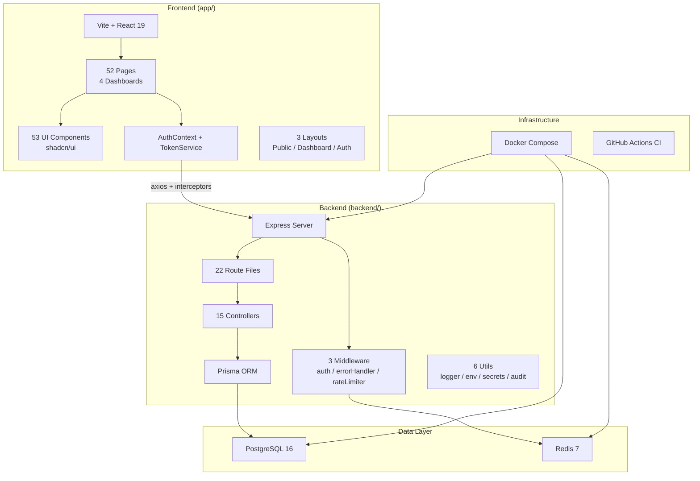

# 🏗️ College Management System — Full Architecture Analysis

> **Status:** Analysis only — no code changes made  
> **Date:** 2026-04-22  
> **Purpose:** Understand current state → identify what to upgrade → what to remove → clean architecture plan

---

## 1. Project Overview

| Layer | Tech | Version |
|-------|------|---------|
| **Frontend** | React + Vite + TypeScript | React 19, Vite 7, TS 5.9 |
| **UI Library** | shadcn/ui (Radix + Tailwind) | TW 3.4 |
| **Backend** | Express + TypeScript | Express 4.22, TS 5.3 |
| **ORM** | Prisma | 5.7 |
| **Database** | PostgreSQL | 16 (Docker) |
| **Cache/Rate-limit** | Redis | 7 (Docker) |
| **Auth** | JWT (access + refresh) + sessions | Custom |
| **Testing** | Vitest (both sides) | 4.1 |
| **CI/CD** | GitHub Actions | Basic lint+test |
| **Deploy** | Docker Compose, Render, Railway | Mixed |

---

## 2. Current Architecture Map



---

## 3. What's GOOD ✅ (Keep)

| Area | Detail |
|------|--------|
| **Database Schema** | 30 models, well-normalized, proper indexes, UUID PKs, cascade deletes. Covers: Users, Students, Parents, Teachers, Admins, Courses, Grades, Attendance, Messages, Behavior, Homework, Health, Pickup, Sessions, Audit. **Solid.** |
| **Auth Middleware** | Session-bound JWTs, device fingerprinting (SHA-256 hash), token versioning, fallback secret rotation. **Enterprise-grade.** |
| **RBAC** | 4 roles (STUDENT/PARENT/TEACHER/ADMIN) enforced at both route & middleware level + resource-level access checks (student_grades, parent_child, teacher_course). |
| **Security Headers** | Helmet CSP, HSTS, Permissions-Policy, X-Content-Type-Options on uploads. |
| **Rate Limiting** | Redis-backed rate limiting with separate limiters for API, login, and password change. |
| **Frontend Code-splitting** | All 52 dashboard pages are lazy-loaded. Public pages are eager (correct). |
| **Structured Logging** | Pino logger with request duration tracking. |
| **Docker Compose** | Clean 3-service setup with healthchecks and volume persistence. |
| **JWT Secret Validation** | Crashes on startup if secrets are weak/missing. 32-char minimum enforced. |

---

## 4. What's BROKEN / WRONG 🔴 (Fix or Remove)

### 4.1 — Security Issues (CRITICAL)

| Issue | Severity | Location | Impact |
|-------|----------|----------|--------|
| **`.env` committed to repo with real DB password & JWT secrets** | 🔴 CRITICAL | `backend/.env` | Full database and auth compromise. Password `RBFMD5FABJJ@` and 96-char JWT secrets are exposed. |
| **No `.env` in `.gitignore` pattern for backend** | 🔴 CRITICAL | Root `.gitignore` | `.env` file is tracked in git. |
| **`SecretRotationAudit` stores secret hashes in plaintext columns** | 🟡 MEDIUM | `schema.prisma:556-557` | Rotation audit logs contain previous/current secret values as plain strings. |

### 4.2 — Documentation Chaos (CLEANUP)

**29 markdown files scattered across the root directory** — totaling ~315 KB of redundant, overlapping, and outdated docs:

| Category | Files | Action |
|----------|-------|--------|
| Admin guides (5 files) | `ADMIN_COMPLETE_SUMMARY`, `ADMIN_CONTENT_EDITING_GUIDE`, `ADMIN_DASHBOARD_GUIDE`, `ADMIN_DASHBOARD_NAVIGATION_GUIDE`, `ADMIN_FUNCTIONALITY` | ❌ Remove — internal notes, not docs |
| Quick references (3 files) | `QUICK_REFERENCE`, `QUICK_REFERENCE_ADMIN_CONTENT`, `QUICK_REFERENCE_CARD` | ❌ Remove — duplicative |
| Dashboard dumps (3 files) | `dashboard-core-code` (101 KB!), `dashboard-core-details`, `dashboards` | ❌ Remove — code-dump artifacts |
| Doc indexes (2 files) | `DOCUMENTATION_COMPLETE_INDEX`, `DOCUMENTATION_INDEX` | ❌ Remove — index of removed files |
| Audit/security logs (4 files) | `AUDIT_REPORT_6MODULES`, `UTF8_AUDIT_REPORT`, `JWT_DUAL_SECRET_VALIDATION`, `README_SECURITY` | ❌ Remove — stale audit snapshots |
| Misc plans (4 files) | `dark_mode_fix_plan`, `oak_redesign_plan`, `CODE_CHANGES`, `PAGES_CREATED` | ❌ Remove — completed or abandoned plans |
| Keep & consolidate (4 files) | `README`, `STARTUP_GUIDE`, `FUNCTIONAL_SPECIFICATIONS_V2`, `TESTING_GUIDE` | ✅ Consolidate into single `README.md` |
| Deployment (2 files) | `INDEX`, `SCALABILITY_GUIDE` | ❌ Remove — not actionable |
| SQL dumps (2 files) | `forum_excellence.sql`, `forum_excellence_neon.sql` | ⚠️ Move to `backend/prisma/seed/` or remove |

### 4.3 — Architecture Issues

| Issue | Detail |
|-------|--------|
| **Monolith `server.ts`** | 221 lines, dynamically imports all 22 routes. Works but not scalable. Should use a route registry pattern. |
| **No service layer** | Controllers talk directly to Prisma. No business logic abstraction between routes/controllers and the DB. |
| **Stale test files in backend root** | `test-admin-content-editing.js`, `test-extreme-load.js`, `test-login-stability.js`, `test-prisma.ts`, `test-server.ts`, `test-upload.js` — raw scripts outside the test framework. |
| **Two Prisma schemas** | `schema.prisma` + `schema_primary_school.prisma` — the second appears unused and confusing. |
| **`dist/` directories committed** | Both `backend/dist/` and `app/dist/` appear to exist — build artifacts should never be committed. |
| **Log files committed** | `backend/backend_log.txt` (291 KB), `app/build.log`, `app/build_after_fix.log`, `app/build_capture.log`, `app/tsc_build_errors.log`, etc. |
| **AdminSettings.tsx is 48 KB** | Single component file — needs to be split into sub-components. |
| **AdminMainPage.tsx is 27 KB** | Same problem — monolith component. |
| **No API type sharing** | Frontend and backend define types independently. No shared contract. |
| **`next-themes` in a Vite/React app** | `next-themes` is a Next.js-specific package. Should use custom ThemeContext (which already exists). |
| **`@types/react-router-dom` in dependencies** | Should be in devDependencies. Also, v5 types but using v7 of react-router-dom. |
| **`nodemon` in frontend devDeps** | Not needed — Vite has HMR. |
| **Mixed deploy configs** | `render.yaml`, `vercel.json`, `railpack.json` (×2), `docker-compose.yml` — pick one platform. |
| **`backend_log.txt` at 291 KB** | Runtime log committed to repo. |

### 4.4 — Frontend Issues

| Issue | Detail |
|-------|--------|
| **App.tsx is 214 lines of flat routes** | No nested routing. Every route repeats `<ProtectedRoute><DashboardLayout>`. Should use layout routes. |
| **53 shadcn components, most unused** | Components like `context-menu`, `menubar`, `navigation-menu`, `carousel`, `hover-card`, `resizable`, `toggle-group` etc. are likely not used. Dead code. |
| **No error boundaries** | No React error boundary anywhere. A single component crash takes down the whole app. |
| **`console.error` still used** | `AuthContext.tsx:80` — should use a proper error reporting mechanism. |

---

## 5. File Inventory Summary

| Category | Count | Notes |
|----------|-------|-------|
| Backend route files | 22 | Good coverage |
| Backend controllers | 15 | Missing: classes, subjects, academicYears, reports, gradeLocks controllers (logic inline in routes?) |
| Backend middleware | 3 | auth, errorHandler, rateLimiter |
| Backend utils | 6 | logger, env, secretManager, secretProvider, audit, securityAlerts |
| Frontend pages | 52 | 21 admin + 10 student + 10 teacher + 11 parent |
| Frontend UI components | 53 | shadcn/ui — many likely unused |
| Frontend layouts | 3 | Public, Dashboard, Auth |
| Frontend contexts | 2 | Auth, Theme |
| Frontend hooks | 3 | use-mobile, useLiveRefresh, useScrollReveal |
| Frontend lib files | 4 | api, errorUtils, tokenService, utils |
| Root markdown docs | 29 | **~315 KB of clutter** |
| Stale test scripts | 6 | In backend root, outside test framework |
| Log/build artifacts | 6+ | Committed runtime/build logs |
| Deploy config files | 4 | render.yaml, vercel.json, 2× railpack.json |
| SQL dump files | 2 | 78 KB + 73 KB |
| OAK design assets | 12 | PNG reference screenshots |

---

## 6. Clean Architecture Plan — What to Do

### Phase 1: CLEANUP (Remove Dead Weight)

```
DELETE:
├── 25 root markdown files (keep README.md, merge STARTUP_GUIDE into it)
├── backend/backend_log.txt (291 KB)
├── backend/test-*.js, backend/test-*.ts (6 files)
├── backend/prisma/schema_primary_school.prisma
├── backend/migrate.log
├── app/build.log, build_after_fix.log, build_capture.log, build_tmp.*, tsc_*.log
├── app/dist/ (if committed)
├── backend/dist/ (if committed)
├── forum_excellence.sql, forum_excellence_neon.sql (or move to seed/)
└── Stale deploy configs: pick ONE (docker-compose) and remove others

UPDATE .gitignore:
├── backend/.env
├── *.log
├── dist/
└── build artifacts
```

### Phase 2: ARCHITECTURE UPGRADE

```
Backend — Add Service Layer:
├── backend/src/services/         ← NEW: Business logic here
│   ├── authService.ts
│   ├── userService.ts
│   ├── gradeService.ts
│   ├── attendanceService.ts
│   └── ... (one per domain)
├── Controllers become thin: validate → call service → respond
└── Services own Prisma queries + business rules

Frontend — Fix Routing:
├── Use React Router nested layout routes
├── Kill the 60-line repeated <ProtectedRoute><DashboardLayout> pattern
└── Add ErrorBoundary at layout level

Frontend — Split Fat Components:
├── AdminSettings.tsx (48 KB) → split into tab sub-components
├── AdminMainPage.tsx (27 KB) → split into section components
└── Any component > 15 KB gets audited
```

### Phase 3: DEPENDENCY CLEANUP

```
REMOVE from app/package.json:
├── next-themes (use existing ThemeContext)
├── nodemon (Vite HMR covers this)
├── @types/react-router-dom (wrong version, unnecessary with v7)

MOVE to devDependencies:
├── (audit all @types/* packages)

UPDATE:
├── Prisma 5.7 → latest 5.x
└── Standardize Node version (CI uses 20, check local)
```

### Phase 4: SECURITY HARDENING

```
IMMEDIATE:
├── Remove backend/.env from git tracking
├── Rotate ALL JWT secrets (they're compromised)
├── Rotate database password
├── Add backend/.env to .gitignore

SCHEMA:
├── SecretRotationAudit: hash the secret columns, don't store plaintext
└── Consider removing this table entirely (use structured logs instead)
```

---

## 7. Current Architecture Rating

| Dimension | Score | Notes |
|-----------|-------|-------|
| **Database Design** | ⭐⭐⭐⭐ | Well-modeled, indexed, normalized |
| **Authentication** | ⭐⭐⭐⭐ | Session-bound JWT + device binding, secret rotation |
| **Authorization** | ⭐⭐⭐⭐ | RBAC + resource-level checks |
| **Backend Structure** | ⭐⭐½ | No service layer, fat controllers, monolith server |
| **Frontend Structure** | ⭐⭐⭐ | Lazy-loading good, but fat components, flat routing |
| **Code Quality** | ⭐⭐½ | Log/build artifacts committed, dead code, inconsistent |
| **Testing** | ⭐⭐ | Only 4 backend + 1 frontend test. Stale test scripts |
| **Documentation** | ⭐½ | 29 files of conflicting, outdated docs |
| **Security** | ⭐⭐ | Good headers/middleware, but .env WITH SECRETS is committed |
| **DevOps/Deploy** | ⭐⭐½ | Docker Compose works, but 4 competing deploy configs |

**Overall: ⭐⭐⭐ out of 5 — Solid foundation, drowning in tech debt and clutter.**
