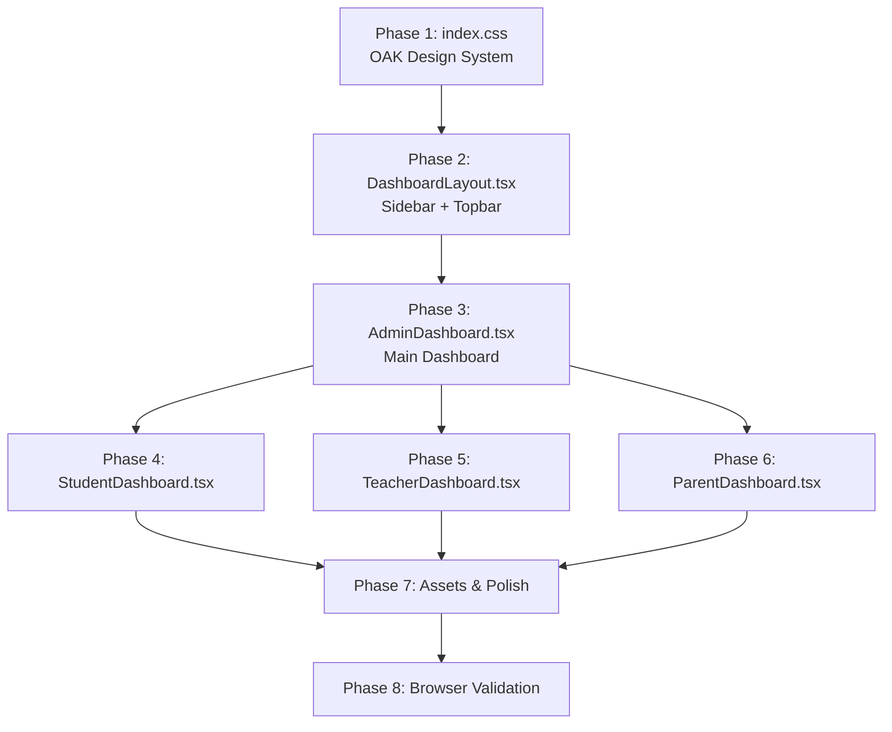

# 🌿 OAK University Dashboard — Full Redesign Plan

> **Goal**: Transform the current Forum de l'Excellence dashboard UI to match the [OAK University Behance design](https://www.behance.net/gallery/229935655/OAK-University-Education-UI-UX-Dashboard-Design) using the 12 reference PNGs in `/oak/`.

---

## 📐 Design Analysis (from 12 PNGs)

### Color Palette (from `oak/2.png`)
| Token | Hex | Usage |
|-------|-----|-------|
| `--oak-olive` | `#AAC240` | Primary brand green — buttons, active states, sidebar accents |
| `--oak-sage` | `#BCCDB6` | Secondary — backgrounds, muted elements |
| `--oak-chartreuse` | `#EFF3A2` | Light accent — stat card badges, highlights |
| `--oak-peach` | `#FFE2AD` | Warm accent — notifications, secondary buttons |
| `--oak-dark` | `#1E1E1E` | Dark card backgrounds (Top Teachers card) |
| `--oak-bg` | `#F2F5EE` | Overall page background (light sage-tinted) |
| `--oak-surface` | `#FFFFFF` | Card backgrounds |
| `--oak-text` | `#1A1A1A` | Primary text |
| `--oak-text-muted` | `#7A7A7A` | Secondary text |

### Typography
- **Display/Headings**: Keep `Cabinet Grotesk` (already in project)
- **Body**: Keep `Satoshi` (already in project)
- **Stat numbers**: Bold, large, tabular-nums

### Key Design Elements (from `oak/10.png`, `oak/11.png`, `oak/12.png`)
1. **Sidebar**: White/light background, green OAK logo icon, clean nav items with olive-green active indicator
2. **Top bar**: Search bar with green icons, user avatars, notification bell
3. **Stat Cards Row**: 3 colored pill cards — Students (green), Teachers (chartreuse), Faculty (sage) — each with count + arrow icon
4. **Hero Banner**: Large campus building image with rounded corners (20px+), overlaid "Add New Members" button
5. **Growth Ring**: Circular progress at 62% with olive/sage colors ("Academy growth")
6. **Students Attendance Chart**: Bar chart with yellow/golden bars, monthly x-axis
7. **Upcoming Events/Exams**: Clean list with date + event name + 3-dot menu
8. **Top Teachers Card**: Dark background (#1E1E1E), teacher avatars, names, roles, arrow links
9. **12 Days Left**: Announcement/countdown card with star/dot decorations
10. **Success Rate**: Semi-circle gauge at 52% with warm yellow tones

---

## 🏗️ Implementation Architecture

### Phase 1: Design System (CSS Variables + Base Styles)
**File**: `app/src/index.css`  
**Tool**: `multi_replace_file_content`

| What changes | Details |
|---|---|
| `:root` color variables | Replace navy/gold palette → OAK olive/sage/chartreuse/peach palette |
| Dark mode variables | Update dark theme to complement OAK colors |
| Sidebar styles | White background, olive-green active indicators instead of navy |
| Card styles | Larger border-radius (20px), softer shadows, no visible borders |
| KPI card styles | New colored pill-style stat cards matching OAK |
| New component classes | `.oak-stat-card`, `.oak-hero-banner`, `.oak-growth-ring`, `.oak-dark-card`, `.oak-event-item`, `.oak-bar-chart` |
| Button styles | Olive green primary, peach secondary |
| Topbar styles | Clean white with search bar, green accents |

### Phase 2: Dashboard Layout (Sidebar + Topbar)
**File**: `app/src/components/layout/DashboardLayout.tsx`  
**Tool**: `replace_file_content` (single contiguous rewrite of the component)

| What changes | Details |
|---|---|
| Sidebar background | Dark navy → Clean white/light with subtle border |
| Logo area | Replace navy logo section with OAK-style green icon + "Forum de l'Excellence" in dark text |
| Nav items | White text on dark → Dark text on white, olive-green active pill indicator |
| User footer | Dark style → Light style with olive accent |
| Topbar | Add search bar input with green search icon, keep theme toggle + user menu |
| Active indicator | Gold sidebar bar → Olive green background pill |
| Mobile overlay | Keep existing logic, update colors |

### Phase 3: Admin Dashboard (Main Showpiece)
**File**: `app/src/pages/dashboard/admin/AdminDashboard.tsx`  
**Tool**: `write_to_file` (full rewrite — the page structure changes completely)

#### Layout Grid (matching `oak/10.png`):
```
┌─────────────────────────────────────────────────────┐
│  [Stat Card 1]  [Stat Card 2]  [Stat Card 3]  │ Hero Banner │
│   Étudiants      Enseignants    Personnel      │  (campus    │
│   2,635 ↗        29 ↗           60 ↗           │   image)    │
├─────────────────┬───────────────┬───────────────────┤
│  ● Growth       │ ▎▎▎▎▎▎▎▎▎▎  │ Upcoming Events   │
│  62%            │ Attendance    │  • Model test...  │
│  Academy growth │ (bar chart)   │  • Final project  │
├─────────────────┼───────────────┼───────────────────┤
│ 12 Days Left    │ Top Teachers  │ Success Rate      │
│ ★★★★★★★★★★    │ (dark card)   │    52%            │
│ announcement    │ Alex, Maria.. │  semi-circle      │
└─────────────────┴───────────────┴───────────────────┘
```

#### New Components (inline in AdminDashboard.tsx):
1. **StatCard** — Colored pill with icon, count, label, trend arrow
2. **HeroBanner** — Campus image with rounded corners + "Add New Members" button overlay
3. **GrowthRing** — SVG circular progress (62%) with olive/sage strokes
4. **AttendanceChart** — CSS/SVG bar chart with golden bars, month labels
5. **EventsList** — Clean list of upcoming events with dates
6. **TopTeachersCard** — Dark background card with teacher avatars
7. **CountdownCard** — "12 Days Left" announcement with star decorations
8. **SuccessRate** — Semi-circle SVG gauge

> **Note**: All data fetching logic from the current AdminDashboard is preserved — only the visual rendering changes.

### Phase 4: Student Dashboard  
**File**: `app/src/pages/dashboard/student/StudentDashboard.tsx`  
**Tool**: `write_to_file` (full rewrite)

Apply the same OAK visual language:
- Replace gradient header → OAK-style hero banner with sage tones
- Replace blue stat cards → OAK olive/chartreuse stat pills
- Replace plain grade lists → OAK event-style list items
- Replace progress section → OAK growth ring + success rate gauge
- Keep all existing data fetching and state logic

### Phase 5: Teacher Dashboard
**File**: `app/src/pages/dashboard/teacher/TeacherDashboard.tsx`  
**Tool**: `write_to_file` (full rewrite, same OAK patterns)

### Phase 6: Parent Dashboard
**File**: `app/src/pages/dashboard/parent/ParentDashboard.tsx`  
**Tool**: `write_to_file` (full rewrite, same OAK patterns)

### Phase 7: Assets & Polish
**Tool**: `generate_image` + `run_command` (copy to public/)

| Asset | Purpose |
|---|---|
| `campus-hero.png` | ✅ Already generated — hero banner image |
| Teacher avatars | Generate 3 placeholder teacher avatar images for the Top Teachers card |
| OAK logo icon | Generate a simple green leaf/tree icon for the sidebar logo |

### Phase 8: Visual Validation
**Tool**: `browser_subagent`

1. Start the dev server (`npm run dev`)
2. Navigate to the login page
3. Log in as admin
4. Screenshot the admin dashboard
5. Compare against `oak/10.png` reference
6. Iterate on spacing, colors, proportions
7. Test responsive behavior (resize browser)
8. Test dark mode toggle

---

## 📁 Files Modified (Summary)

| File | Action | Tool |
|------|--------|------|
| `app/src/index.css` | Edit — new OAK design tokens + component classes | `multi_replace_file_content` |
| `app/src/components/layout/DashboardLayout.tsx` | Edit — white sidebar, green accents, search bar | `write_to_file` (overwrite) |
| `app/src/pages/dashboard/admin/AdminDashboard.tsx` | Rewrite — full OAK dashboard layout | `write_to_file` (overwrite) |
| `app/src/pages/dashboard/student/StudentDashboard.tsx` | Rewrite — OAK visual language | `write_to_file` (overwrite) |
| `app/src/pages/dashboard/teacher/TeacherDashboard.tsx` | Rewrite — OAK visual language | `write_to_file` (overwrite) |
| `app/src/pages/dashboard/parent/ParentDashboard.tsx` | Rewrite — OAK visual language | `write_to_file` (overwrite) |
| `app/public/campus-hero.png` | Add — hero banner image | `generate_image` + `run_command` |

## 📁 Files NOT Modified (preserved as-is)

- All backend files (`backend/`)
- All auth pages (`pages/auth/`)
- All public pages (`pages/public/`)
- All sub-dashboard pages (grades, schedule, homework, etc.)
- All context files (`contexts/`)
- All hooks, utils, lib files
- `App.tsx` (routing unchanged)
- `tailwind.config.js` (unchanged)
- `App.css` (unchanged)

---

## ⚡ Execution Order



### Estimated Changes
- **~300 lines** CSS edits (design tokens + new components)
- **~350 lines** DashboardLayout rewrite
- **~500 lines** AdminDashboard rewrite (biggest change)
- **~400 lines** StudentDashboard rewrite
- **~350 lines** TeacherDashboard rewrite
- **~350 lines** ParentDashboard rewrite
- **Total: ~2,250 lines** of UI code

---

## 🎯 Design Fidelity Targets

| Element | OAK Reference | Priority |
|---------|---------------|----------|
| Color palette (#AAC240, #BCCDB6, #EFF3A2, #FFE2AD) | `oak/2.png` | 🔴 Critical |
| White sidebar with green accents | `oak/10.png` | 🔴 Critical |
| Stat cards row (Students/Teachers/Faculty) | `oak/10.png` | 🔴 Critical |
| Hero campus banner with rounded corners | `oak/10.png` | 🔴 Critical |
| Growth circular progress (62%) | `oak/3.png`, `oak/5.png` | 🟡 High |
| Students Attendance bar chart | `oak/4.png`, `oak/10.png` | 🟡 High |
| Upcoming Events/Exams list | `oak/6.png`, `oak/7.png` | 🟡 High |
| Top Teachers dark card | `oak/8.png`, `oak/9.png` | 🟡 High |
| 12 Days Left countdown | `oak/7.png` | 🟢 Medium |
| Success Rate semicircle | `oak/4.png`, `oak/5.png` | 🟢 Medium |
| Search bar in topbar | `oak/10.png` | 🟢 Medium |
| Responsive mobile views | `oak/5-8.png` | 🟢 Medium |
| Dark mode adaptation | N/A (extension) | 🔵 Nice-to-have |

---

> [!IMPORTANT]
> All existing **data fetching logic**, **API calls**, **auth guards**, **routing**, and **backend code** remain completely untouched. This is a **pure visual/UI redesign**.
