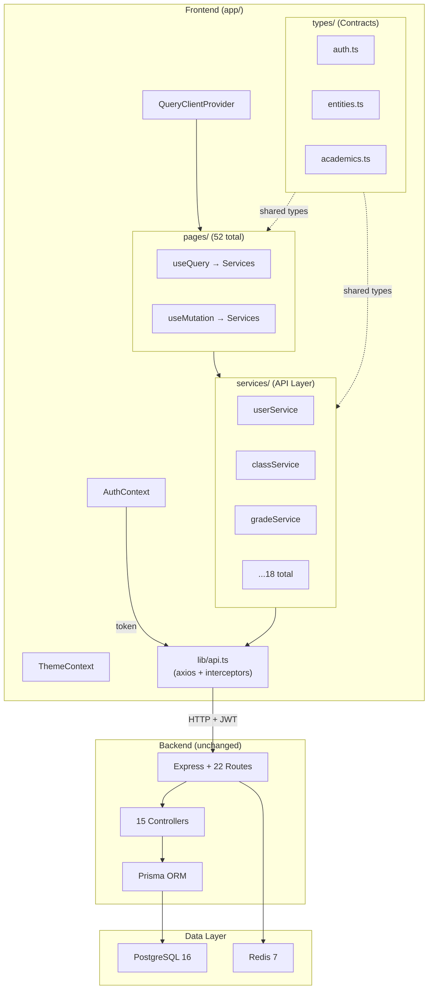

# 🏗️ Forum de l'Excellence — Clean Architecture Blueprint

> **Status:** Architecture plan — no code changes  
> **Date:** 2026-04-22  
> **Scope:** Full-stack cleanup + TanStack Query migration

---

## 1. Target Folder Structure

### Frontend (`app/src/`)

```
app/src/
├── main.tsx                          # Entry point
├── App.tsx                           # Routes (refactored to nested layout routes)
├── App.css
├── index.css                         # Design system tokens
│
├── lib/                              # Core infrastructure
│   ├── api.ts                        # ✅ KEEP (fix validateStatus)
│   ├── queryClient.ts                # 🆕 TanStack QueryClient config
│   ├── tokenService.ts               # ✅ KEEP (in-memory tokens)
│   ├── errorUtils.ts                 # ✅ KEEP
│   └── utils.ts                      # ✅ KEEP (cn utility)
│
├── services/                         # 🆕 API service layer (typed axios calls)
│   ├── authService.ts
│   ├── userService.ts
│   ├── classService.ts
│   ├── subjectService.ts
│   ├── gradeService.ts
│   ├── gradeLockService.ts
│   ├── scheduleService.ts
│   ├── attendanceService.ts
│   ├── appointmentService.ts
│   ├── messageService.ts
│   ├── behaviorService.ts
│   ├── homeworkService.ts
│   ├── healthService.ts
│   ├── pickupService.ts
│   ├── reportService.ts
│   ├── academicYearService.ts
│   ├── parentStudentService.ts
│   ├── settingsService.ts
│   ├── uploadService.ts
│   └── homepageService.ts
│
├── types/                            # 🆕 Shared TypeScript interfaces
│   ├── auth.ts                       # User, LoginRequest, etc.
│   ├── entities.ts                   # Student, Teacher, Parent, Admin
│   ├── academics.ts                  # Course, Grade, Schedule, Subject
│   ├── communication.ts              # Message, Appointment, Behavior
│   ├── operations.ts                 # Attendance, Homework, Health, Pickup
│   └── settings.ts                   # All settings models
│
├── hooks/                            # Custom hooks
│   ├── use-mobile.ts                 # ✅ KEEP
│   ├── useScrollReveal.ts            # ✅ KEEP
│   └── useLiveRefresh.ts             # ❌ DELETE after migration
│
├── contexts/
│   ├── AuthContext.tsx                # ✅ KEEP (add queryClient.clear on logout)
│   └── ThemeContext.tsx               # ✅ KEEP
│
├── components/
│   ├── ScrollToTop.tsx                # ✅ KEEP
│   ├── layout/
│   │   ├── PublicLayout.tsx           # ✅ KEEP
│   │   ├── DashboardLayout.tsx        # ✅ KEEP
│   │   └── AuthLayout.tsx             # ✅ KEEP
│   └── ui/                           # ✅ KEEP (audit unused later)
│       └── (53 shadcn components)
│
├── pages/
│   ├── auth/                         # ✅ KEEP as-is
│   ├── public/                       # ✅ KEEP as-is
│   └── dashboard/
│       ├── admin/    (21 pages)      # Refactor: useState+useEffect → useQuery
│       ├── student/  (10 pages)      # Same refactor
│       ├── teacher/  (10 pages)      # Same refactor
│       └── parent/   (11 pages)      # Same refactor
│
└── tests/
    ├── App.test.tsx                   # ✅ KEEP
    └── setup.ts                       # ✅ KEEP
```

### Backend (`backend/src/`)

```
backend/src/
├── server.ts                         # ✅ KEEP (already solid)
│
├── routes/          (22 files)       # ✅ KEEP all
├── controllers/     (15 files)       # ✅ KEEP all
├── middleware/
│   ├── auth.ts                       # ✅ KEEP (enterprise-grade)
│   ├── errorHandler.ts               # ✅ KEEP
│   └── rateLimiter.ts                # ✅ KEEP
├── lib/
│   └── prisma.ts                     # ✅ KEEP
├── utils/
│   ├── logger.ts                     # ✅ KEEP
│   ├── env.ts                        # ✅ KEEP
│   ├── secretManager.ts              # ✅ KEEP
│   ├── secretProvider.ts             # ✅ KEEP
│   ├── audit.ts                      # ✅ KEEP
│   └── securityAlerts.ts             # ✅ KEEP
├── tests/           (4 files)        # ✅ KEEP
└── prisma/
    ├── schema.prisma                 # ✅ KEEP
    └── schema_primary_school.prisma  # ❌ DELETE (unused, confusing)
```

### Root Directory (CLEANUP)

```
ROOT — BEFORE (39 files + 7 dirs):
├── 29 markdown files (~315 KB)       # ❌ DELETE 25, keep 4
├── 2 SQL dumps                       # ❌ DELETE or move
├── 4 deploy configs                  # ⚠️ Keep 1 (docker-compose)
├── oak/ (12 PNGs)                    # ✅ KEEP (design reference)
└── Various config files              # ✅ KEEP

ROOT — AFTER (clean):
├── README.md                         # ✅ Consolidate from 4 kept docs
├── docker-compose.yml                # ✅ KEEP
├── .gitignore                        # ✅ UPDATE (add .env, *.log, dist/)
├── .editorconfig                     # ✅ KEEP
├── start-all.bat                     # ✅ KEEP
├── .github/                          # ✅ KEEP
├── .vscode/                          # ✅ KEEP
├── app/                              # Frontend
├── backend/                          # Backend
└── oak/                              # Design reference
```

---

## 2. What Gets DELETED

### Root Level (25 files, ~300 KB)

| File | Why |
|------|-----|
| `ADMIN_COMPLETE_SUMMARY.md` | Internal notes, not docs |
| `ADMIN_CONTENT_EDITING_GUIDE.md` | Redundant |
| `ADMIN_DASHBOARD_GUIDE.md` | Redundant |
| `ADMIN_DASHBOARD_NAVIGATION_GUIDE.md` | Redundant |
| `ADMIN_FUNCTIONALITY.md` | Redundant |
| `API_QUICK_REFERENCE.md` | Merge key parts into README |
| `ARCHITECTURE_DIAGRAM.md` | Replace with this doc |
| `AUDIT_REPORT_6MODULES.md` | Stale audit |
| `CODE_CHANGES.md` | Historical, no value |
| `DOCUMENTATION_COMPLETE_INDEX.md` | Index of deleted files |
| `DOCUMENTATION_INDEX.md` | Same |
| `INDEX.md` | Same |
| `JWT_DUAL_SECRET_VALIDATION.md` | Move to backend/README if needed |
| `PAGES_CREATED.md` | Historical |
| `QUICK_REFERENCE.md` | Redundant |
| `QUICK_REFERENCE_ADMIN_CONTENT.md` | Redundant |
| `QUICK_REFERENCE_CARD.md` | Redundant |
| `README_ADMIN_CONTENT_EDITING.md` | Redundant |
| `README_SECURITY.md` | Merge into README |
| `SCALABILITY_GUIDE.md` | Not actionable |
| `UTF8_AUDIT_REPORT.md` | Completed audit |
| `dark_mode_fix_plan.md` | Completed plan |
| `dashboard-core-code.md` (101 KB!) | Code dump artifact |
| `dashboard-core-details.md` | Same |
| `dashboards.md` | Same |
| `oak_redesign_plan.md` | Completed plan |
| `forum_excellence.sql` | Prisma handles DB |
| `forum_excellence_neon.sql` | Same |
| `package-lock.json` (root) | Invalid — not a monorepo root |

### Backend (9 files)

| File | Why |
|------|-----|
| `backend_log.txt` (291 KB) | Runtime log in repo |
| `migrate.log` | Build artifact |
| `test-admin-content-editing.js` | Stale test outside framework |
| `test-extreme-load.js` | Same |
| `test-login-stability.js` | Same |
| `test-prisma.ts` | Same |
| `test-server.ts` | Same |
| `test-upload.js` | Same |
| `prisma/schema_primary_school.prisma` | Unused duplicate schema |

### Frontend (6 files)

| File | Why |
|------|-----|
| `build.log` | Build artifact |
| `build_after_fix.log` | Same |
| `build_capture.log` | Same |
| `build_tmp.err` | Same |
| `build_tmp.out` | Same |
| `tsc_build_errors.log` | Same |

### Deploy Configs to Remove (keep only docker-compose)

| File | Why |
|------|-----|
| `render.yaml` | Pick one platform |
| `app/vercel.json` | Same |
| `app/railpack.json` | Same |
| `backend/railpack.json` | Same |

---

## 3. What Gets FIXED

### Fix 1: `api.ts` — validateStatus

```diff
 export const api = axios.create({
   baseURL: API_BASE_URL,
   withCredentials: true,
-  validateStatus: () => true,
 });
```
**Why:** `validateStatus: () => true` prevents axios from rejecting on errors. TanStack Query needs rejected promises to detect errors. The response interceptor already handles 401s.

### Fix 2: `.gitignore` — Add missing patterns

```diff
+# Environment files with secrets
+backend/.env
+.env
+
+# Build artifacts
+dist/
+
+# Logs
+*.log
+backend/backend_log.txt
+
+# IDE
+.vscode/settings.json
```

### Fix 3: Frontend Dependencies

```diff
 # INSTALL
+@tanstack/react-query
+@tanstack/react-query-devtools

 # REMOVE
-next-themes          # Next.js-specific, already have ThemeContext
-nodemon              # Vite HMR handles this
-@types/react-router-dom  # Wrong version (v5 types, using v7)
```

---

## 4. Architecture Diagram — Target State



**Key changes from current state:**
1. `QueryClientProvider` wraps the app — manages all caching, refetch, and background sync
2. `services/` layer sits between pages and `api.ts` — typed functions, not raw axios calls in components
3. `types/` directory — shared interfaces matching Prisma schema
4. Pages use `useQuery`/`useMutation` — no more `useState + useEffect` for data
5. `useLiveRefresh` deleted — TanStack's `refetchInterval` + `refetchOnWindowFocus` replaces it

---

## 5. Execution Phases

### Phase 0: Foundation (Do first, blocks everything)

| Task | Files | Est. |
|------|-------|------|
| `npm install @tanstack/react-query @tanstack/react-query-devtools` | package.json | 1 min |
| Remove `next-themes`, `nodemon`, `@types/react-router-dom` | package.json | 1 min |
| Create `lib/queryClient.ts` | 1 new file | 5 min |
| Wrap App in `<QueryClientProvider>` | App.tsx or main.tsx | 5 min |
| Fix `validateStatus` in api.ts | api.ts line 46 | 1 min |
| Add `queryClient.clear()` to logout | AuthContext.tsx | 1 min |
| Create `types/` directory with interfaces | 6 new files | 30 min |

### Phase 1: Service Layer (P1 modified)

| Task | Files | Est. |
|------|-------|------|
| Create 19 service files mapping to real backend routes | 19 new files | 1-2 hrs |
| Each service exports typed functions using `api.get/post/put/delete` | — | — |
| NO phantom services (no announcement, no dashboard/stats) | — | — |

### Phase 2: Dashboard Migration (P2 + P3 combined)

| Task | Files | Est. |
|------|-------|------|
| Refactor AdminDashboard → useQueries | 1 file | 30 min |
| Refactor StudentDashboard → useQueries | 1 file | 20 min |
| Refactor TeacherDashboard → useQueries | 1 file | 20 min |
| Refactor ParentDashboard → useQueries | 1 file | 20 min |
| Refactor remaining 48 pages → useQuery | 48 files | 4-6 hrs |
| Add loading skeletons, error states, empty states | All pages | Included |

### Phase 3: Mutations Migration (P4)

| Task | Files | Est. |
|------|-------|------|
| Refactor all `api.post/put/delete` → `useMutation` | ~24 files | 2-3 hrs |
| Add `invalidateQueries` on success | All mutations | Included |
| Add toast notifications via sonner | All mutations | Included |
| Add loading states on submit buttons | All forms | Included |

### Phase 4: Cleanup & Config (P5 modified + P7)

| Task | Files | Est. |
|------|-------|------|
| Delete `useLiveRefresh.ts` | 1 file | 1 min |
| Fine-tune QueryClient defaults | queryClient.ts | 10 min |
| Add "Last updated" indicator to dashboards | 4 files | 20 min |
| Audit sweep: verify zero manual fetch patterns remain | All files | 30 min |
| Delete root markdown files | 25 files | 5 min |
| Delete stale test scripts from backend root | 6 files | 2 min |
| Delete log/build artifacts | ~6 files | 2 min |
| Update .gitignore | 1 file | 5 min |

---

## 6. What We DON'T Touch

| Area | Reason |
|------|--------|
| Backend code | Already solid — routes, controllers, middleware, auth all work |
| Prisma schema | 30 models, well-designed |
| shadcn/ui components | Working UI library (audit unused ones later) |
| Public pages (HomePage, etc.) | Not part of this migration |
| Auth pages (Login, Register, ChangePassword) | Already functional |
| Docker Compose | Already correct |
| CI/CD pipeline | Already works |
| OAK design assets | Reference material |

---

## 7. Total Effort Estimate

| Phase | Files Changed | Time |
|-------|--------------|------|
| Phase 0: Foundation | ~10 | 45 min |
| Phase 1: Services | ~25 new | 1-2 hrs |
| Phase 2: Queries | ~52 refactored | 5-7 hrs |
| Phase 3: Mutations | ~24 refactored | 2-3 hrs |
| Phase 4: Cleanup | ~40 deleted/fixed | 1 hr |
| **TOTAL** | **~76 files touched, ~40 deleted** | **~10-13 hrs** |
